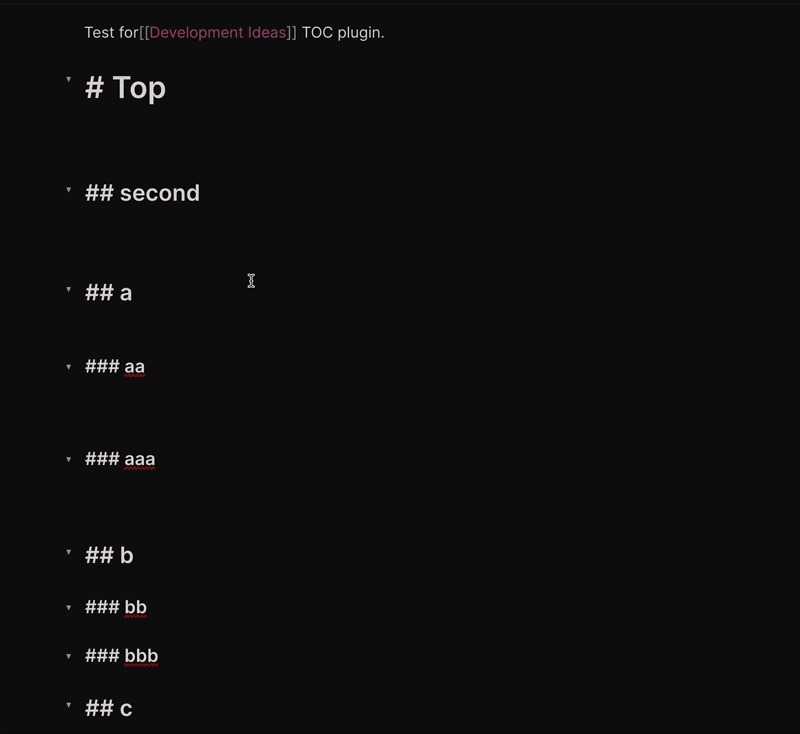

# obsidian-plugin-toc

Create a table of contents for a note.



## Features

This plugin exposes the following commands:

| Action                                          | Hotkey           |
| ----------------------------------------------- | ---------------- |
| Create full table of contents                   | Blank by default |
| Create table of contents for next heading level | Blank by default |

And the following settings:

| Setting              | type                 | Default    |
| -------------------- | -------------------- | ---------- |
| List Style           | 'bullet' or 'number' | 'bullet'   |
| Title                | 'string'             | undefined' |
| Minimum header depth | number               | 2          |
| Maximum header depth | number               | 6          |

## Usage

This plugin will create a table of content for the sub-heading of the current heading level.

**Example:**

_Input:_ Run "Table of Contents" under a level 2 heading  
_Output:_ "Table of Contents" only contains subheadings of that level 2 heading

## Installing

Either install the latest release from Obsidian directly or unzip the [latest release](https://github.com/hipstersmoothie/obsidian-plugin-toc/releases/latest) into your `<vault>/.obsidian/plugins/` folder.

Once the plugin is installed, you need to make sure that the switch for "Table of Contents" is turned on.
After you are all setup you would see this plugins commands in the command palette (`CMD + P`).
You can assign the commands to hotkeys for easy usage.

Here is my setup:

- Create full table of contents => `CMD + SHIFT + T`
- Create table of contents for next heading level => `CMD + T`

## Customizations

### Detailed Nested Ordered Lists

If you want the table of contents to use nested list counting (ex: 1.1, 1.2) add the following CSS snippet to obsidian.
This will effect all ordered lists in your notes.

```css
ol {
  counter-reset: item;
}

ol li {
  display: block;
}

ol li:before {
  content: counters(item, ".") ". ";
  counter-increment: item;
  padding-right: 5px;
}
```

> NOTE: Make sure you enable the snippet in obsidian's options.
